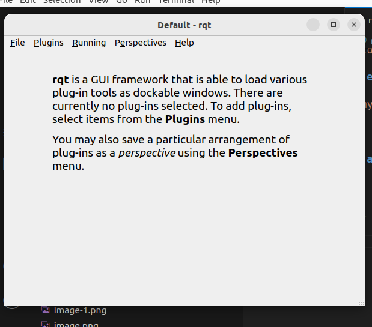
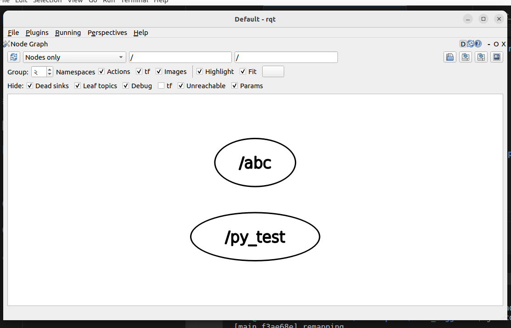
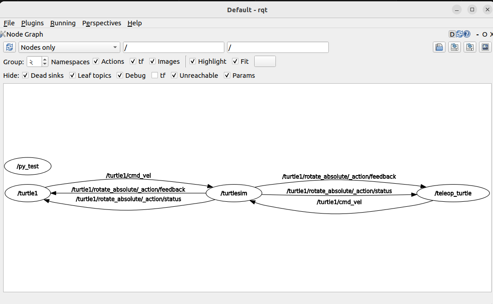

# Introduction to ROS2 tools
###### In this section you will learn more about some of the most useful ROS2 tools. Those tools are an important part of the ROS2 ecosystem, they will allow you to debug your nodes and your whole ROS2 application

# ros2 run 
#### The command ros2 run launches an executable from a package.
```bash
ros2 run <package_name> <executable_name>
```
# ros2 node list 
#### ros2 node list will show you the names of all running nodes. This is especially useful when you want to interact with a node, or when you have a system running many nodes and need to keep track of them.
```bash
  ros2 node list 
  # The terminal return the node name 
  /py_node
```
# ros2 node info 
#### returns a list of subscribers, publishers, services, and actions. i.e. the ROS graph connections that interact with that node. 
```bash
  ros2 node info /py_node
```
#### The output should look like this 
```bash
/py_test
  Subscribers:

  Publishers:
    /parameter_events: rcl_interfaces/msg/ParameterEvent
    /rosout: rcl_interfaces/msg/Log
  Service Servers:
    /py_test/describe_parameters: rcl_interfaces/srv/DescribeParameters
    /py_test/get_parameter_types: rcl_interfaces/srv/GetParameterTypes
    /py_test/get_parameters: rcl_interfaces/srv/GetParameters
    /py_test/list_parameters: rcl_interfaces/srv/ListParameters
    /py_test/set_parameters: rcl_interfaces/srv/SetParameters
    /py_test/set_parameters_atomically: rcl_interfaces/srv/SetParametersAtomically
  Service Clients:

  Action Servers:

  Action Clients:
```
# Remapping 
#### In production we have to need rename a node at runtime .If we run same node in two times it will run in ros2 but the output will be like this 

```bash
   # 1st terminal 
   ros2 run my_py_pkg py_node 
   # 2nd terminal 
   ros2 run my_py_pkg py_node 
   # output will be like this 
   ros2 node list
    WARNING: Be aware that are nodes in the graph that share an exact name, this can have unintended side effects.
    /py_test
    /py_test

```
#### To avoid this we can use remaping concept to run same node multiple time 

```bash
# run 
ros2 run my_py_pkg py_node
# output 
[INFO] [1700504141.799906847] [py_test]: Hello ROS2
[INFO] [1700504142.301921317] [py_test]: Hello1
[INFO] [1700504142.802002565] [py_test]: Hello2
[INFO] [1700504143.301641592] [py_test]: Hello3
[INFO] [1700504143.801780340] [py_test]: Hello4

# this command will help you to run same node multiple time 
ros2 run my_py_pkg py_node --ros-args --remap __node:=abc 
# after run this command output 
[INFO] [1700504063.619443744] [abc]: Hello ROS2
[INFO] [1700504064.121111773] [abc]: Hello1
[INFO] [1700504064.621056218] [abc]: Hello2
[INFO] [1700504065.121293105] [abc]: Hello3
[INFO] [1700504065.620878255] [abc]: Hello4
[INFO] [1700504066.120831051] [abc]: Hello5

```
#### Here run same node 2 timer after remaping py_test node will be change abc node and run this node without any warning 

```python
import rclpy
import rclpy.node import Node 

class Mynode(Node):
    def __init__(self):
        super().__init__("py_test") # here node will be dynamically change when run rempaing command to run node multiple times
        self.get_logger().info("Hello ROS2")

```
# Againg colcon 
#### In development time after modify python file you have to complie every time for changes and run 
```bash
 colcon build --packages-select my_py_pkg 

```
#### But every time compile for new changes it will be painful for us .We can use symlink argument with colcon build to avoid this 

```bash
 colcon build --packages-select my_py_pkg --symlink-install
```
#### To run executable this package node, into to pakcage directory using cd and run 
```bash
  chmod +x my_first_node.py
```
# RQT GUI 

#### Rqt is a debugging tool or GUI , it's help to debugging ros2 in development proccess 
#### rqt_graph to visualize the changing nodes and topics, as well as the connections between them.

```bash
# run 
rqt 
# open a gui 
```
 

#### To monitoring the runing node selecting Plugins > Introspection > Node Graph
```bash
  # run node 
  ros2 run my_py_pkg py_node 
  ros2 run my_py_pkg py_node --ros-args --remap __node:=abc  
```
#### Referesh rqt graph 


[Click to read about rqt_graph](https://docs.ros.org/en/humble/Tutorials/Beginner-CLI-Tools/Understanding-ROS2-Topics/Understanding-ROS2-Topics.html)

# Let's fun with turtlesim 
[turtlesim](https://docs.ros.org/en/humble/Tutorials/Beginner-CLI-Tools/Introducing-Turtlesim/Introducing-Turtlesim.html)

#### I have run some nodes with different names, and here is what I see with rqt_graph.
