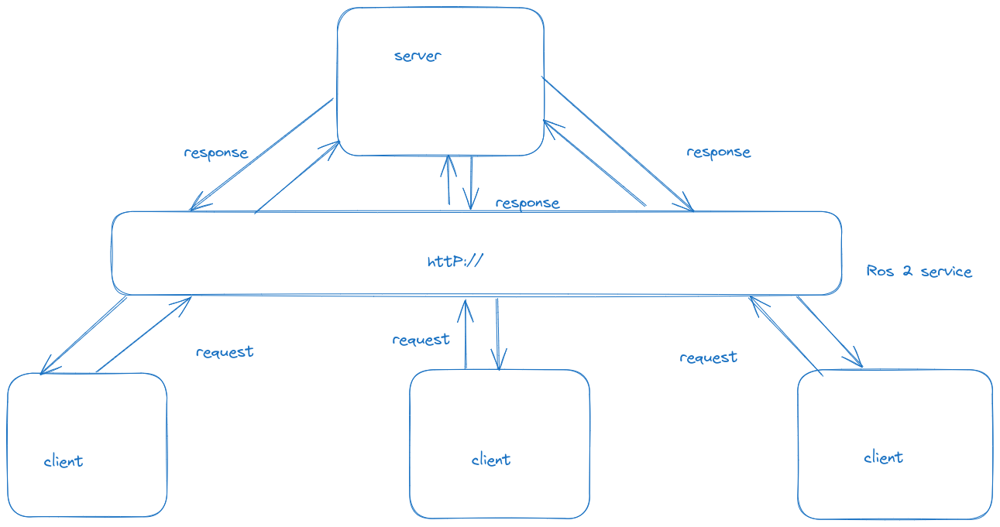

# ROS2 Service 

1. A ROS2 service is a client/server system 
2. Synchronous or asynchronous 
3. One message type for request and one message type for response.
4. Can be written in Python , C++ .
5. A service Server can only exist one but can have many clients .

#### Example of ROS2 service system design 


[Understanding services](https://docs.ros.org/en/humble/Tutorials/Beginner-CLI-Tools/Understanding-ROS2-Services/Understanding-ROS2-Services.html#understanding-services)

#### Cretae A python ros2 server 
```bash
 cd /ros2_begginers/Src/my_py_pkg/my_py_pkg
 touch add_two_ints_server.py 

 # make it executeable 
 chmod +x add_two_ints_server.py
 
 # first you need to know the structure of the input arguments.In thsi we used examples interfaces 
  ros2 interface show example_interfaces/srv/AddTwoInts 
  int64 a
  int64 b
  ---
  int64 sum
  # above the --- the line tell us the request arguments of server type AddTwoInts and int64 sum is the response arguments of this server type 
  

```
#### create python server 
```python
 # follow the template of python node 
 # add interface dependecies
 from example_interfaces.srv import AddTwoInts 
 # create server with this line 
 self.server_ = self.create_service(AddTwoInts, "add_two_ints", self.callback_add_two_ints)
 # here for create-service take 3 arguments , 1st one is Service type ,2nd one  service name and 3rd one a callback function to proccess the request and return response 
 # Please follow the full code in  /Src/my_py_pkg/my_pkg 

```