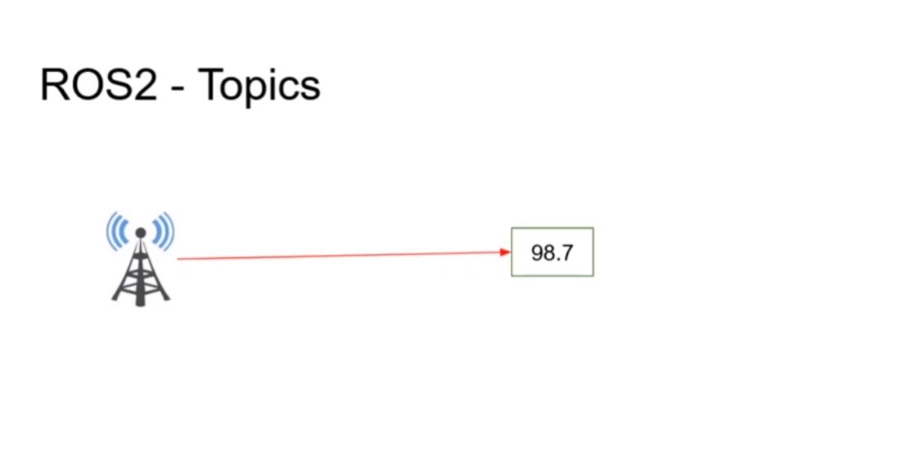
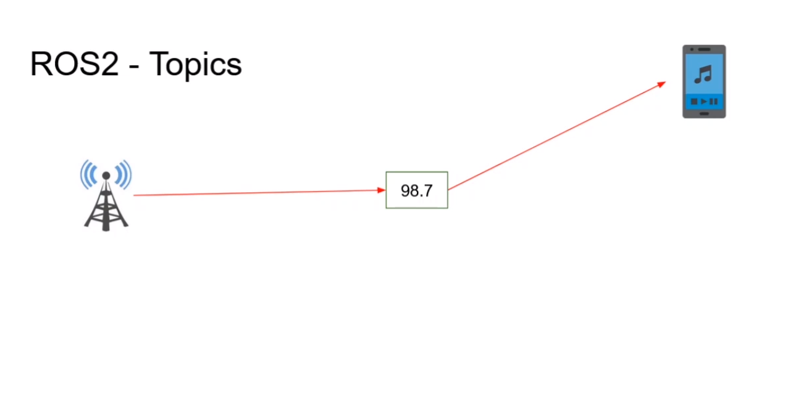
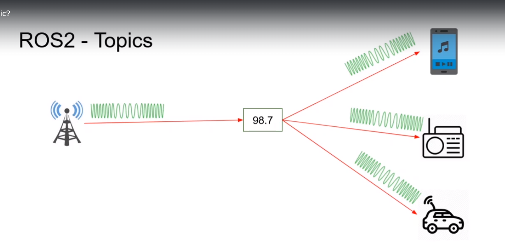
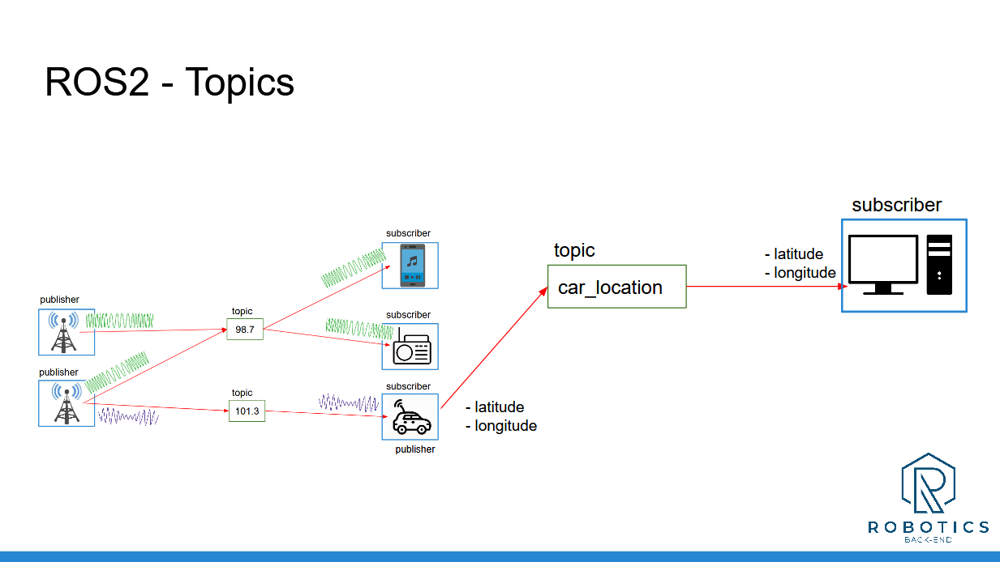

# ROS2 Topics 
#### Before going to defintion of ros2 topics I will give you analogy to make easier to understand ros2 topics 

## Lets suppose we have one radio station that will publish data using 98.7 frequency data 


####  Here Radio station is a node, it's publish data stream into 98.7 frequency. So you can remember as a name or topic to listen the music from it .


#### To Listen the music form 98.7hz your smartpone node have to subscribe this topic . Publisher node  radio station send data and subscriber node smartphone receive data with same  data structure.
### And Here we can see radio station publisher publish fm signal over the 98.7 topic and smartphone subscriber receive data form the 98.7 topic .


#### Many subscribers on a topic 

```bash
# when you create new nodes you have to add below line in setup.py line 
 'console_scripts': [
            "py_node = my_py_pkg.my_first_node:main",
            "robot_news_station = my_py_pkg.robot_news_station:main"
        ]
   # If file name and node name same it will be helpful
  # Then build this node in your roswork space 
  chmod +x robot_news_station # use this for node executeable 
  # run this package 
  ros2 run my_py_pkg robot_news_station 

  # open another terminal 
  # See topic list in the publisher 
  ros2 topic list 
  # echo topic to see the publisher data 
  ros2 topic echo /robot_news
```
### How to rename ros node and ros topic 
```bash
# node rename 
ros2 run my_py_pkg robot_news_station --ros-args -r __node:= my_station

# topic rename 
ros2 run my_py_pkg robot_news_station --ros-args -r __node:= my_station -r robot_news:= my_news

# After remapping the publisher node and topic , subscriber node subscribe data by robot_news topic 
# so subscriber topic also will be remap 
ros2 run my_py_pkg smartphone --ros-args -r robot_news:= my_news
```
# Section Conclusion 
#### In this section you have seen how to use ROS2 Topics to communicate between your nodes.

#### Now, you can already create more complex applications!
#### To recap, a topic is:

1. A named bus over which nodes exchange messages
2. Used for unidirectional data streams
3. Anonymous: publishers don’t know who is subscribing, and subscribers don’t know who is publishing.

#### To implement topics in your ROS2 application:
1. First create a node (or start from an existing one), then inside your node you can create any number of publishers/subscribers.
2. A publisher and subscriber must publish/subscribe to the same topic name, and use the same data type. Those are the 2 conditions for successful topic communication.

3. Then, once you’ve added some publishers/subscribers in your nodes, just launch your nodes, and the communication starts! You can debug them using the “ros2” command line tool, as well as rqt.

# Ros2- Topics 


#### Note: your topic names should start with a letter (“98.7” is not a valid topic name, it was just used to introduce the concept with a real life analogy).

#### By using nodes, you can easily separate your code into different independent modules, one for each part of your application. And with topics, you can make them communicate.

#### And now, after Topics, the next logical step is to look at ROS2 Services. That’s what we’ll see in the next section.
