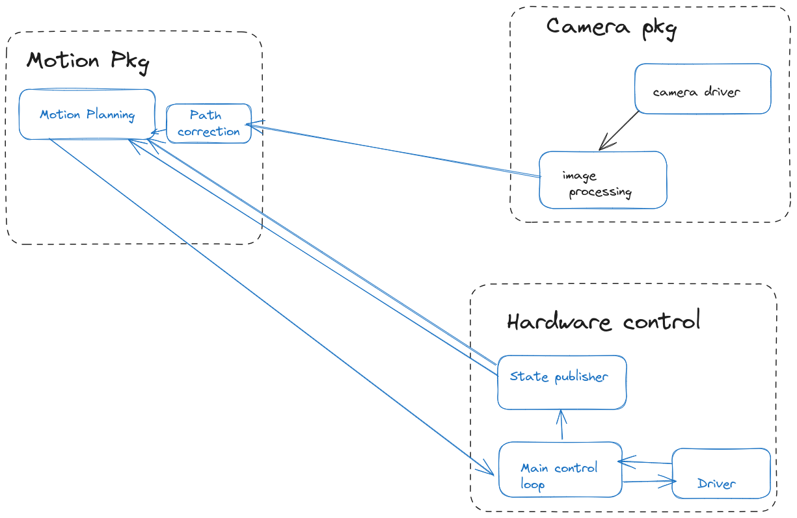

# Setup your ROS2 environment
```bash
source /opt/ros/humble/setup.bash

gedit ~/.bashrc
# Add the following line at the end of the file and save it
source /opt/ros/humble/setup.bash

# install ros2 dependencies 
sudo apt install python3-colcon-common-extensions


gedit ~/.bashrc
# Add the following line at the end of the file and save it
source /usr/share/colcon_argcomplete/hook/colcon-argcomplete.bash
```
# ROS2 python package 
```bash
# cd to your directory 
cd ros2_ws/src
# create pkg command 
ros2 pkg create my_py_pkg(pkg name) --build-type (argument) ament_python --dependencies rclpy

```
 
# before build to check 
```bash
 pip3 list 
 # if not found 
 sudo apt install python3-pip
 # then check again 
 pip3 list 

 pip3 list | grep setuptools 

 # check verison and upgrade 
 pip3 install setuptools==version no

```
# Compile to your package
```bash
colcon build 
# your package successfully build 

# if you want build specific  packages
colcon build --packages-select my_py_pkg 
# hurrah! your python package now ready to host any python node 
```
# Create C++ package 
```bash
ros2 pkg create my_cp_pkg --build-type ament_cmake --dependencies rclcpp
```
# Build c++ package 
```bash
  colcon build 
  colcon build --packages-select my_cp_pkg
```
# ROS2 -Nodes 
* subprograms in your application, responsible for only one thing as like class .
* Combined into a graph .
* Two nodes communicate with each other through ros topics , service and parameter .
